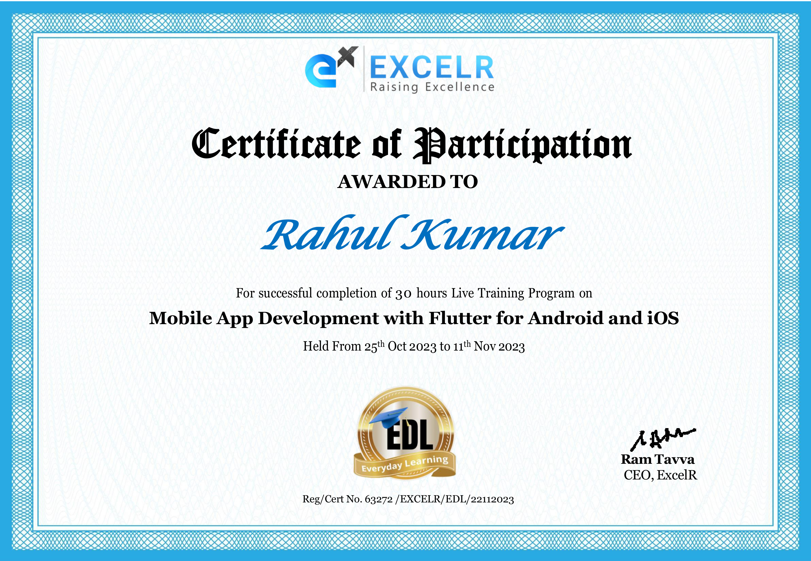

# excelr_flutter
30 hours Flutter course by 16 years experience teacher

### Trainer intro

- Kalim Ansari (16+ years experience)
- Flutter certified
- currently Senior Manager and Corporate Trainer

## Certificate

## Days:

- [Day 01: Basic - Dart and Flutter](/day1.md)
- [Day 02: Basic - Data types, Operators, Control flow and functions](/day2.md)
- [Day 03: OOPS - Encapsulation [Class, Object, Constructor], Polymorphism, Inheritance](/day3.md)
- [Day 04: OOPS - Abstraction, Interface, Mixin, Synchronous vs Asynchronous](/day4.md)
- [Day 05: First Flutter App](/day5.md)
- [Day 06: Explore Flutter Widgets](/day6.md)
- [Day 07: Random number generator, ListView](/day7.md)
- [Day 08: List generator, Longlist, alertbox, STATEFUL APP](/day8.md)
- [Day 09: Navigation, Routing](/day9.md)
- [Day 10: Bottom Navigation Bar](/day10.md)
- [Day 11: Network call - Theory (API)](/day11.md)
- [Day 12: Network call - Practical](/day12.md)
- [Day 13: Shared Preferences](/day13.md)
- [Left Navigation Panel (SELF)](/day14.md)