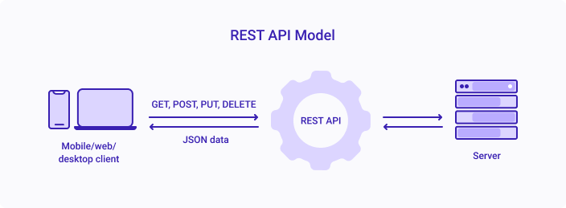

<h1 align="center"> Day 11 (Flutter Excelr)</h1>

## Working with API - Theory
> How network call is done?

1. [API related terms](#api-related-terms)
2. [Client Server Architecture](#client-server-architecture)
3. [API and WebServices](#api-and-webservices)


## API related terms

- API - Application Programming Interface
- REST - Representational State Transfer
- SOAP - Simple Object Access Protocol
- JSON - JavaScript Object Notation
- HTTP - Hyper Text Transfer Protocol
- HTTPS - Hyper Text Transfer Protocol Secure
- URL - Uniform Resource Locator
- URI - Uniform Resource Identifier
- GET - Read, POST - Create, PUT - Update, DELETE - Delete
- API Key - Unique key to identify the user
- API Endpoint - URL to access the API


## Client Server Architecture




`Client` Anyone(mobile/browser/software/app) who makes request to the server 

`Server` Anyone who responds to the request


```
Let's assume that there is a centralized dB of ABC company. 
Most of the employees of the company can access it.

You are not an employee of the company and suppose you get access to the dB, 
then you can ADD, DELETE or UPDATE the dB which is very dangerous.

But you need data from ABC dB, so there should be a procedure/mechanism through which you can get the data.

Here comes API.

```
## API and WebServices

- API is nothing but a program written in any programming language and resides on the server.

- WebService is a type of API which always uses HTTP protocol.

- All WebServices are API but all API are not WebServices.

- responsibility of API

    - go and talk to dB, do whatever needs to be done and pass the response back to the client.
- `Response` can be in any format like JSON, XML, HTML, etc. but mostly JSON is used.


<br><br>
<h1 align="center"> <a href="/day12.md">Day 12 Flutter</a></h1>