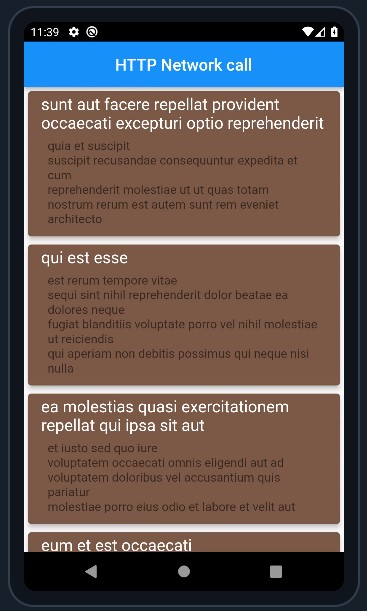

<h1 align="center"> Day 12 (Flutter Excelr)</h1>

## Working with API - Practical




## code

```dart
import 'package:flutter/material.dart';
import 'package:http/http.dart' as http;
// responsible for n/w call, connect to server and get the data
import 'dart:convert'; 
// responsible for converting the incoming stream of 0s and 1s into object


// MODEL class (POJO class in java) responsible for holding incoming data temporarily
class Posts {
  final int id;
  final int userId;
  final String title;
  final String body;

  Posts({
    required this.id,
    required this.userId,
    required this.title,
    required this.body,
  });
}

class MyApi extends StatefulWidget {
  const MyApi({super.key});
  @override
  State<MyApi> createState() => _MyApiState();
}

class _MyApiState extends State<MyApi> {
  Future<List<Posts>> getRequest() async {
    // getRequest is a special method i.e asynchronous method
    // which is a network call that returns "list of Posts" at some point in the future
    
    final url = Uri.parse("https://jsonplaceholder.typicode.com/posts");
    // Uri: is a Dart class specifically designed to represent and manipulate URLs.
    // parse(): checks whether the given URL is valid or not by breaking it into different parts(scheme, host, path, etc.)
    // scheme: "https"; host: "jsonplaceholder.typicode.com"; path: "/posts"

    final response = await http.get(url);
    // http.get(url) => http package k get() ka use karke, server se "HTTP GET request" send kr rhe hn
    // in response, server Returns a Future object which means data will be available at some point in the future
    // that's why "await" is used, which Pauses the execution of the current async fn i.e getRequest(),
    // until the Future completes (i.e until the server response is received), 
    // finally response data is stored in response variable

    var responseData = json.decode(response.body);
    // response.statusCode ==> statusCode: 200 => success || 404 => not found
    // response.headers    ==> {cache-control: max-age=43200, content-type: application/json; charset=utf-8, expires: -1, pragma: no-cache}
    // response.body       ==> gives the entire HTTP response data in raw JSON format
    // json.decode()       ==> decode() fn is from dart:convert;
    //    Takes JSON raw data as input and converts it into a Dart data structure (usually Map<String, dynamic> or List or List of Maps).
    //    This process is called JSON parsing or deserialization; serialization(converting dart => json)
    // Why to decode or do deserialization?
    //  bcoz  Dart doesn't support json; 
    //  to structure data properly and gain access to properties of data structure(Map, List, etc) like [0], .first, .add('lol'), etc


    // creating a list to store input data
    List<Posts> users = [];
    for (var singlePost in responseData) {
      // responseData is a "List of Maps" i.e [{},{},{}......]
      Posts user = Posts(
        id: singlePost["id"],
        userId: singlePost["userId"],
        title: singlePost["title"],
        body: singlePost["body"],
      );

      // Adding user to the list
      users.add(user);
    }
    return users;
  }

  @override
  Widget build(BuildContext context) {
    return Scaffold(
      appBar: AppBar(
        title: const Text("HTTP Network call"),
        centerTitle: true,
      ),
      body: FutureBuilder(
        // used to build UIs which contain future data
        // The FutureBuilder widget tracks the state of the Future and calls the builder function with the snapshot object whenever its state changes
        future: getRequest(),
        builder: (BuildContext ctx, AsyncSnapshot snapshot) {
          // snapshot object holds the "data" returned by Future(null otherwise)
          // also captures the current state i.e ConnectionState(none, waiting, active, done) of the asynchronous operation and helps in dynamically building UI
          if (snapshot.data == null) {
            return const Center(
              child: CircularProgressIndicator(),
            );
          } else {
            return ListView.builder(
              itemCount: snapshot.data!.length,
              // ensures that the list renders only as many items as there are items in the fetched data
              itemBuilder: (ctx, index) => Card(                
                margin: const EdgeInsets.all(5),
                color: Colors.brown,
                elevation: 5,
                child: ListTile(
                  title: Text(
                    snapshot.data[index].title,
                    // '${snapshot.data[index].id}', 
                    style: const TextStyle(
                      fontSize: 20,
                      color: Colors.white,
                    ),
                  ),
                  
                  subtitle: Padding(
                    padding: const EdgeInsets.all(8.0),
                    child: Text(
                      snapshot.data[index].body,
                      style: const TextStyle(
                        fontSize: 15,
                      ),
                    ),
                  ),
                ),
              ),
            );
          }
        },
      ),
    );
  }
}

```
<br><br>
<h1 align="center"> <a href="/day13.md">Day 13 Flutter</a></h1>