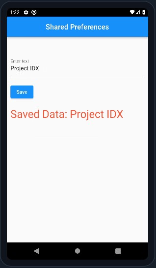

<h1 align="center"> Day 13 (Flutter Excelr)</h1>

## Ways to store data

1. Local Memory (Phone memory):
    - Shared Preferences
    - sqlite db
    - Files

2. Remote Location:
    - Remote Server (API)
    - Cloud Storage (Firebase)

## Local memory vs remote location

- Local memory is easily accessible but data you store will be limited

- Remote location is not easily accessible but data you store will be unlimited

- Local memory is used to store the data temporarily (cache) or permanently (database)

- Local memory is accessible by only you or the app installed in your device

- Remote location is accessible by everyone who has access to the server


## SQLite Database

- used to store large amount of data in the form of tables.
- used to store complex data types like list, map etc.

    Advantages:

        - comes as a library in dart
        - does not need to do any configuration
        - light weight and specially designed for mobile devices
        - follows relational database model

## Shared Preferences

- used to store small amount of data in key-value pair.
- used to store primitive data types like boolean, int, double, string and list.
- data is usually stored in XML format.
- When we tick the remember me option in login page, the data is stored in shared preferences.
- on next login, the data is retrieved from shared preferences and the user is logged in automatically without entering the credentials again.
- Shared Preferences can be visualized as cookies in web development, which mostly store passwords and tokens.
- Cookies are nothing but small files stored in the browser.


    ### What to store in shared preferences?

        - user data (name, email, phone, password, etc.) like in login page
        - api data (key, token, user id, etc.)
        - app data (is user logged in, is user new, etc.)
        - app settings (theme, language, font size etc.)
        - app cache (images, videos etc.)

## Cloud Storage (Firebase)

- Firebase is a Backend-as-a-Service (BaaS) platform developed by Google.
- Firebase is particularly popular for mobile app development.
- Firebase is used to store data in the form of JSON.
- provides various tools and services to help developers build, manage, and grow their apps.

### Features of Firebase

1. Real-time Database: 
    
    - Firebase provides a NoSQL database that allows you to store and sync data in real-time. This is a great feature for apps that require real-time data updates, such as chat apps or multiplayer games.

2. Authentication:
        
    - Firebase provides a built-in authentication system that allows you to easily authenticate users to your app. It supports authentication using passwords, phone numbers, popular federated identity providers like Google, Facebook and Twitter, and more.

3. Cloud Storage:

    - Firebase provides a cloud storage service that allows you to store and serve user-generated content, such as photos or videos.

4. Hosting:

    - Firebase provides a hosting service that allows you to host your web app on Firebase servers. 

5. Machine Learning: 
    - Firebase's ML Kit provides a range of machine learning functionality that can be easily integrated into your app.

6. Analytics: 
    - Firebase provides a built-in analytics system that allows you to easily track user behavior and measure the success of your app.

7. Crash Reporting: 
    - Firebase provides a built-in crash reporting system that allows you to easily track and fix app crashes.

8. Test Lab: 
    - Firebase provides a built-in test lab that allows you to easily test your app on real devices.

9. Cloud Messaging: 
    - Firebase provides a built-in cloud messaging system that allows you to easily send push notifications to your users.

10. AdMob: 
    - Firebase provides a built-in ad network that allows you to easily monetize your app. <br><br>


## Developed App



## Code

```dart
import 'package:flutter/material.dart';
import 'package:shared_preferences/shared_preferences.dart';

void main() {
  runApp(const MyApp());
}

class MyApp extends StatefulWidget {
  const MyApp({super.key});

  @override
  State<MyApp> createState() => _MyAppState();
}

class _MyAppState extends State<MyApp> {
  final TextEditingController _controller = TextEditingController();
  String _savedText = '';

  @override
  // life cycle of widget, this method gets called before build(), when screen loads
  void initState() {
    super.initState();
    loadSavedData();
  }

  saveData() async {
    SharedPreferences prefs = await SharedPreferences.getInstance();
    prefs.setString('saved_text', _controller.text);
    loadSavedData();
  }

  loadSavedData() async {
    SharedPreferences prefs = await SharedPreferences.getInstance();
    setState(() {
      _savedText = prefs.getString('saved_text') ?? '';
    });
  }

  @override
  Widget build(BuildContext context) {
    return SafeArea(
      child: MaterialApp(
        debugShowCheckedModeBanner: false,
        home: Scaffold(
          appBar: AppBar(
            title: const Text("Shared Preferences"),
            centerTitle: true,
          ),
          body: Padding(
            padding: const EdgeInsets.fromLTRB(10, 50, 10, 0),
            child: Column(
              crossAxisAlignment: CrossAxisAlignment.start,
              children: [
                TextField(
                  controller: _controller,
                  decoration: const InputDecoration(
                    labelText: "Enter text",
                  ),
                ),
                const SizedBox(
                  height: 20,
                ),
                ElevatedButton(                  
                  onPressed: saveData,
                  child: const Text("Save"),
                ),
                const SizedBox(
                  height: 20,
                ),
                Text(
                  "Saved Data: $_savedText",
                  style: const TextStyle(
                    color: Colors.red,
                    fontSize: 30,
                  ),
                ),
              ],
            ),
          ),
        ),
      ),
    );
  }
}

```

<br><br>
<h1 align="center">Excelr Flutter Successfully Completed</h1>