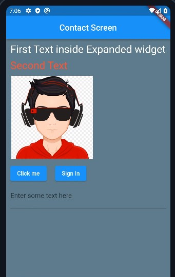

<h1 align="center"> Day 6 (Flutter Excelr)</h1>

## Flutter Starts

```dart
import 'package:flutter/material.dart';

void main() => runApp(const MyApp());

class MyApp extends StatelessWidget {
  const MyApp({super.key});

  @override
  Widget build(BuildContext context) {
    return MaterialApp(
      title: "Hello",
      home: Scaffold(
        appBar: AppBar(
          title: const Text("HOME SCREEN"),
          centerTitle: true,
        ),
        backgroundColor: Colors.greenAccent,
        body: const Center(
          child: Text(
            "Welcome to Flutter",
            style: TextStyle(
              fontSize: 30,
            ),
          ),
        ),
      ),
    );
  }
}

```
## Today's App 




<br><br>
<h1 align="center"> <a href="/day7.md">Day 7 Flutter</a></h1>