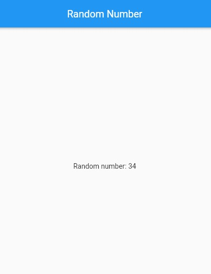
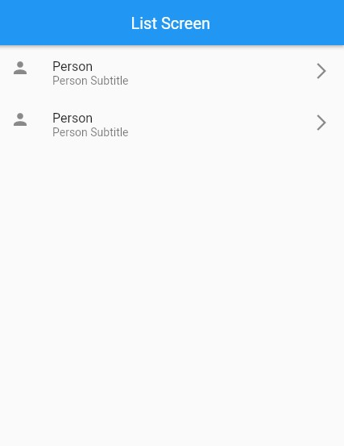

<h1 align="center"> Day 7 (Flutter Excelr)</h1>

## New Widgets used: 

- ListView
- ListTile
---

## main.dart

- Takes to Home Screen where a random number is generated
- Takes to List Screen where a list is displayed

```dart
import 'package:flutter/material.dart';
import 'package:myapp/home.dart';
import 'package:myapp/listview.dart';

void main() {
  runApp(const MyApp());
}

class MyApp extends StatelessWidget {
  const MyApp({super.key});

  @override
  Widget build(BuildContext context) {
    return const SafeArea(
      child: MaterialApp(
        debugShowCheckedModeBanner: false,
        home: Home(),
        // home: ListScreen(),
      ),
    );
  }
}

```

## home.dart

- Generates a random number between 0 and 100



```dart
import 'dart:math';
import 'package:flutter/material.dart';

class Home extends StatelessWidget {
  const Home({super.key});

  @override
  Widget build(BuildContext context) {
    return Scaffold(
      appBar: AppBar(
        title: const Text("Random Number"),
        centerTitle: true,
      ),
      body: Center(
      child: Text("Random number: ${randomNo()}"),
    ),
    );
  }

  int randomNo() {
    var no = Random().nextInt(100);
    return no;
  }
}

```

## listview.dart

- Displays a list of items



```dart
import 'package:flutter/material.dart';

class ListScreen extends StatelessWidget {
  const ListScreen({super.key});

  @override
  Widget build(BuildContext context) {
    return Scaffold(
      appBar: AppBar(
        title: const Text("List Screen"),
        centerTitle: true,
      ),
      body: getList(),
    );
  }
}

getList() {
  return ListView(
    children: const[
      ListTile(
        leading: Icon(Icons.person),
        title: Text("Person1"),
        subtitle: Text("Person1 Subtitle"),
        trailing: Icon(Icons.arrow_forward_ios),
      ),
      ListTile(
        leading: Icon(Icons.person),
        title: Text("Person2"),
        subtitle: Text("Person2 Subtitle"),
        trailing: Icon(Icons.arrow_forward_ios),
      ),
    ],
  );
}

```
## other way (listview.dart)

```dart
import 'package:flutter/material.dart';

class ListScreen extends StatelessWidget {
  const ListScreen({super.key});

  @override
  Widget build(BuildContext context) {
    return Scaffold(
      appBar: AppBar(
        title: const Text("List of items"),
        centerTitle: true,
      ),
      body: ListView(        
        children: [
          getList("1", "List 1", "Sub title 1"),
          getList("2", "List 2", "Sub title 2"),
          getList("3", "List 3", "Sub title 3")
        ],
      ),
    );
  }

  final String lead = "", titl = "", subtitl = "";

  getList(lead, titl, subtitl){
    return ListTile(
      leading: Text(lead),
      title: Text(titl),
      subtitle: Text(subtitl),
      trailing: const Icon(Icons.edit),
    );
  }
}
```

<br><br>
<h1 align="center"> <a href="/day8.md">Day 8 Flutter</a></h1>