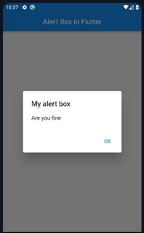
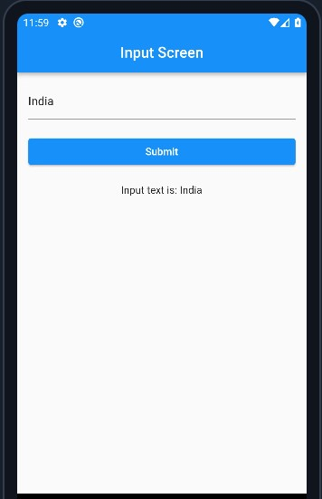

<h1 align="center"> Day 8 (Flutter Excelr)</h1>

1. [Disadvantages of ListView](#disadvantages-of-listview)
2. [List generator](#list-generator)
3. [Long list == ListView.builder()](#long-list--listviewbuilder)
4. [Alertbox](#alertbox)
5. [Stateful widget](#stateful-widget)

## Topics
- List generator
- Long list i.e ListView.builder()
    > Adapter in Android
- alertbox
- input text and display it on click of submit button (using setState)


## Disadvantages of ListView
- not aware of how much data is coming from db or server 5, 10 or 5k
    - so we need a dynamic list(called Longlist in dart)
        - ListView hi hai but builder method use kr rhe hn list ko build krne k liye
- other problem with yesterday's list is that - 
everything gets loaded on the screen,leads to memory occupancy

- adv (longlist) => when we scroll then only the items get loaded on the screen


## List generator

```dart

// The lambda fn is called once for each element in the list, 
// and the return value of the function is used to populate the element.

void main() {
  print(
    List.generate(
      10, // max limit or no of times the fn is to be called
      (counter) {
        return counter;
      },
    ),
  );
}

output
[0, 1, 2, 3, 4, 5, 6, 7, 8, 9]
```

## Long list == ListView.builder()


```dart
getLongList() {
    // get data from generate method
    var generatedList = generateListElements();
    var myListView = ListView.builder(
      itemCount: 10, // removes the red error (visible in screenshot)
      // tells exactly how many items to be built. 
      itemBuilder: (context, index) {
        // context = this screen i.e this class; index = index of list items
        return ListTile(
          title: Text(
            generatedList[index],
          ),
        );
      },
    );
    // this builder is going to help in building the item(each row) one by one
    return myListView;
  }

  // generate list elements
  generateListElements() {
    var myListItems = List.generate(10, (counter) => "Generated Element : $counter");
    return myListItems;
  }
```


## Alertbox



```dart
ElevatedButton(
  onPressed: () {
    showDialog(context: context, builder: (ctx){
      return AlertDialog(        
        title: const Text("My alert box"),                
        content: const Text("Are you fine"),
        actions: [
          TextButton(onPressed: (){
            Navigator.of(ctx).pop();
          }, child: const Text("OK"))
        ],
      );
    });
  },
  child: const Text("show alert"),
)
```


# Stateful widget

  > Get input from user and display it on click of submit button



```dart
import 'package:flutter/material.dart';

class InputScreen extends StatefulWidget {
  const InputScreen({super.key});
  @override
  State<InputScreen> createState() => _InputScreenState();
}

class _InputScreenState extends State<InputScreen> {
  String name = '';
  // important
  TextEditingController inputcontroller = TextEditingController();

  @override
  Widget build(BuildContext context) {
    return Scaffold(
      appBar: AppBar(
        title: const Text("Input Screen"),
        centerTitle: true,
      ),
      body: Padding(
        padding: const EdgeInsets.all(15.0),
        child: Column(
          children: [
            Row(
              children: [
                Expanded(
                  child: TextField(
                    controller: inputcontroller, // important
                  ),
                ),
              ],
            ),
            const SizedBox(
              height: 20,
            ),
            Row(
              children: [
                Expanded(
                  child: ElevatedButton(
                    onPressed: () {
                      setState(() {
                        name = inputcontroller.text;
                      });
                    },
                    child: const Text("Submit"),
                  ),
                ),
              ],
            ),
            const SizedBox(
              height: 20,
            ),
            Text("Input text is: $name"),
          ],
        ),
      ),
    );
  }
}

```

<br><br>
<h1 align="center"> <a href="/day9.md">Day 9 Flutter</a></h1>
